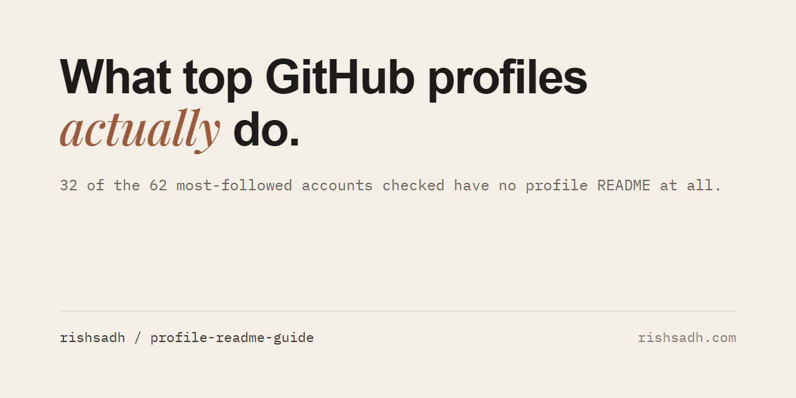

# What top GitHub profile READMEs actually contain

I checked 62 of the most-followed accounts on GitHub for a profile README, and coded the 30 that have one. Read on 29 September 2026. Data, script and method are in this repository, and every number below traces to [data/profiles.csv](data/profiles.csv).

## The finding

Most top accounts keep the profile README short, or skip it. Of the 44 most-followed accounts checked, 25 have none: torvalds, gaearon, yyx990803, 3b1b, getify and taylorotwell among them. Across all 30 READMEs found, the median is about 20 lines. Three embed a stats widget. None uses a typing-animation header.

The most-followed account among the 30 (karpathy, 223,632 followers) has a one-line README: "I like deep neural nets."

Stats cards, a typing header and a wall of badges are not what these accounts do. Their audiences sit on repositories: the median most-starred repo among the 30 has 9,115 stars. The README is the least of it.

## The data

Accounts checked: 62 (the 44 most-followed on the top-300 list, plus the 9 most-followed of each of two peer sets, designers and SEO/marketing people). Followers as read on 29 September 2026.

| | Count | Share |
|---|---|---|
| No profile README | 32 of 62 | 52% |
| Has a profile README | 30 of 62 | 48% |

Of the 32 without one, 31 have no `{login}/{login}` repository at all. One (lucidrains) has the repository but no README file.

The 30 READMEs:

| Feature | Count of 30 | Share |
|---|---|---|
| 30 lines or fewer | 20 | 67% |
| 20 lines or fewer | 15 | 50% |
| Under 1,000 bytes | 14 | 47% |
| 50 lines or more | 4 | 13% |
| Headers (Markdown or HTML) | 20 | 67% |
| Opens with a greeting | 9 | 30% |
| Any shields.io image | 9 | 30% |
| Badge or icon wall (5 or more) | 7 | 23% |
| Stats widget | 3 | 10% |
| Typing-animation header | 0 | 0% |
| 5 links or fewer | 16 | 53% |

Median length is 20.5 lines and 1,190 bytes. The longest is 202 lines. Length does not track audience in any useful way: the Spearman correlation between followers and line count is -0.06 across all 30, and 0.25 among the 19 top-followed accounts. Both are weak.

Pinned repositories are more common than READMEs. 37 of the 62 use all six pin slots, and 14 pin nothing. Of the 30 with a README, 22 pin six. Of the 32 without, 15 do. That is a correlation, not a cause.

One pattern I did not expect. Of the 8 README owners whose best repo has under 1,000 stars, 3 use a stats widget. Of the 22 whose best repo has 1,000 or more, none does. The less an account has to point at, the more the profile page is decorated. Eight is a small group, so hold it loosely.

## What to do

Pin six repositories first. It is quick, and more accounts here use it than have a README.

Then, if you write a README, write about 20 lines. Say who you are and what you make in the first line. Link out to your site and one thing you built, and a few more if you have them: the median is 4 or 5 links. Karpathy's README is one line and kentcdodds's is eight.

The length and the link count come from the data. The first-line advice is mine. I coded how each README opens (13 headings, 9 HTML blocks, 3 links, 3 plain text, 1 image, 1 empty). The most common opening is a heading, at 13 of 30. No opening is shared by most.

If you have nothing to show yet, skip the README. 32 of these 62 did.

## What not to bother with

A typing header. 0 of 30.

A stats widget. 3 of 30, and none of the 22 accounts with a 1,000-star repo. The best-known widget tool, github-readme-stats, has 79,820 stars (`gh api repos/anuraghazra/github-readme-stats`, read 29 September 2026), so it is popular. In this sample of top accounts it is rare.

A badge wall. 7 of 30. I read the image URLs of those 7 by hand: 4 are mostly tech-stack icons, 2 are live follower or star counters, 1 is contact links.

## Method

Short version. I took the 44 most-followed accounts of a 300-account list, and the first 9 of each peer set ranked by followers. For each I requested `GET /repos/{login}/{login}/readme`, and coded the returned text with fixed rules. [method.md](method.md) has the exact selection rule, every API call and every coding rule. `python code_profiles.py` regenerates the CSV. `python summarize.py` prints every number in this file.

Each README is stored as a size and a SHA-256 hash, not as text, so the CSV shows what was coded without republishing anyone's file.

## Limits

n is small. 30 READMEs coded, 62 accounts checked for existence.

The accounts are the most-followed, which is not the population of people starting out. For 22 of the 30, the most-starred repo has 1,000 stars or more, so the audience is likely to predate the README. I have no data on whether a README changes what a visitor does. This describes what top accounts have, not what works.

The peer sets were found with English bio keywords ("designer", "design engineer", "creative developer", and SEO and marketing terms), so they miss people who describe themselves in other languages. Some READMEs in the sample are Spanish or Portuguese, and the greeting rule knows only a few languages. That search is not part of this repository. The 62 logins are frozen in [data/selection.csv](data/selection.csv).

Checking stopped once 30 READMEs had been found, so the 32 without are those checked before that point.

The rules for "stats widget" and "badge wall" are mine. They look at image sources only. A rule that also counted a plain link to the stats tool's docs would give 4 of 30, and a different badge threshold would change the wall count.

I did not code visitor counters, snake animations or GitHub Sponsors sections.

## Cite, and licence

Rish Sadh, "What top GitHub profile READMEs actually contain", 2026-09-29.

Text and data: CC BY 4.0 ([LICENSE](LICENSE)). Scripts: MIT ([LICENSE-CODE](LICENSE-CODE)).

By @rishsadh
